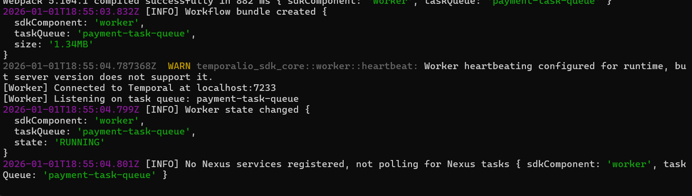
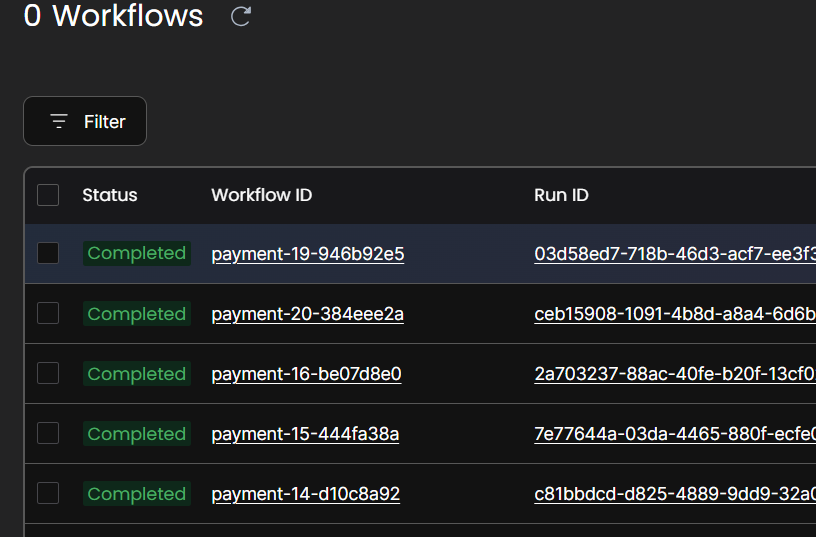
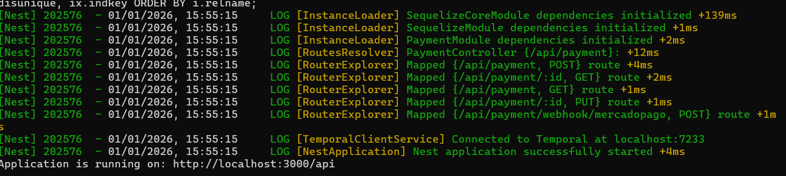
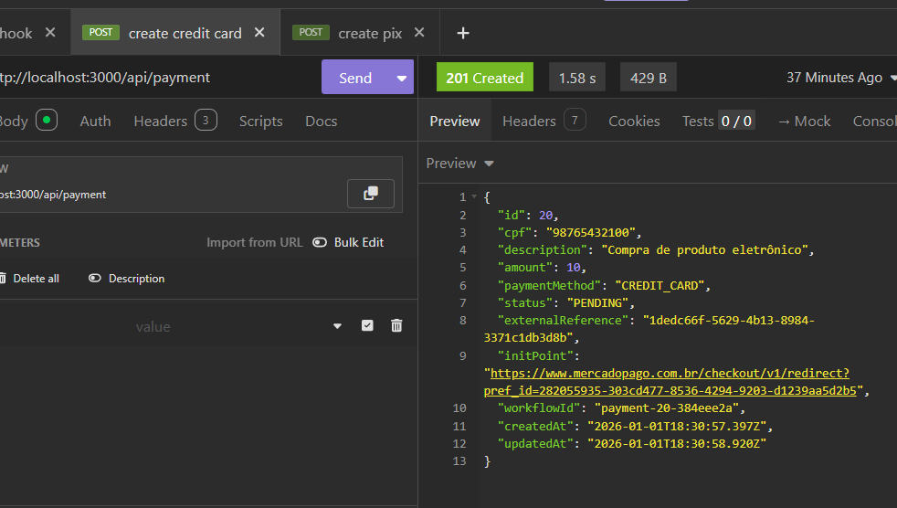
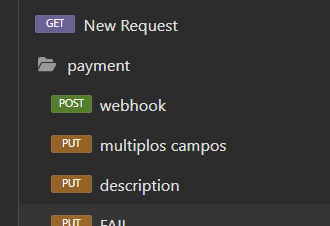

# Desafio EXA

O seguinte projeto é um teste técnico NodeJS para a empresa EXA

## 1. Stacks

O projeto utiliza as seguintes tecnologias

- NodeJS
- NestJS
- Postgres
- Temporal.io
- Docker

# 2. Execução do projeto

Antes de tudo crie uma cópia do arquivo `.env.example` para `.env`

Primeiro inicie o banco de dados e servidor temporal

```
docker-compose -f docker-compose.temporal.yml up -d
```

Dentro da pasta do projeto instale as dependencias com o comando
```
npm i
```

Agora inicie o banco de dados com oo comando

```
npm run database
```

Após isso inicie o worker

```
npm run temporal:worker
```



Será possível acessar no seguinte endereço

```
http://localhost:8080
```



Agora sim podemos iniciar o projeto

```
npm run start:dev
```


A aplicação será iniciada na porta 3000

## 3. Acessibilidade

Em anexo está o arquivo  [Insomnia_2026-01-01.yaml](./scripts/Insomnia_2026-01-01.yaml)  para importar no insmonia para testar





